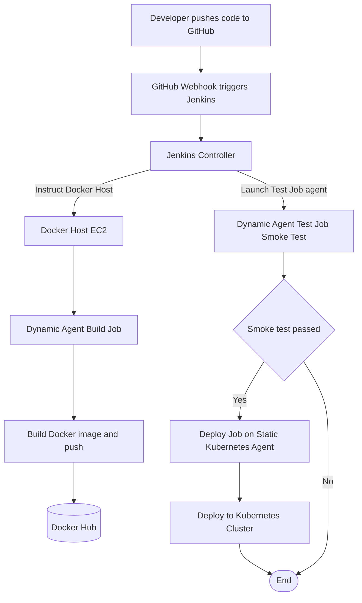

# CI/CD Pipeline with Dynamic Jenkins Agents & Automated Testing

## Project Overview
This project represents the final evolution of a comprehensive CI/CD pipeline, focusing on efficiency, cost-optimization, and quality assurance. The primary goal was to move away from a static infrastructure model, where Jenkins agents run 24/7, to a dynamic, on-demand system.

By leveraging the Jenkins Docker plugin, this pipeline automatically provisions temporary, containerized agents only when a job needs to run. Once the job is complete, the agent is automatically destroyed. This "on-demand" infrastructure significantly reduces resource wastage and cloud costs.

Furthermore, this pipeline introduces an automated testing stage as a critical quality gate, ensuring that only validated application builds are deployed to the final Kubernetes environment.

---

## Final Architecture Diagram
The final pipeline follows a three-stage, event-driven workflow that utilizes both dynamic and static agents for maximum efficiency and reliability.

### Workflow:
1. A developer pushes code to GitHub.  
2. A webhook triggers the Jenkins Controller.  
3. The Jenkins Controller instructs the Docker Host (an EC2 instance) to launch a Dynamic Agent Container for the build job.  
4. The dynamic agent builds the application's Docker image and pushes it to Docker Hub.  
5. The Controller then launches another dynamic agent for the Test Job, which performs a smoke test on the new image.  
6. Only if the test succeeds, the Controller triggers the Deploy Job, which runs on a Static Kubernetes Agent to deploy the application to the Kubernetes Cluster.  

---

## Technology Stack
- **CI/CD Orchestration:** Jenkins  
- **Containerization & Dynamic Agents:** Docker, Docker Hub  
- **Container Orchestration:** Kubernetes (Minikube)  
- **Cloud Provider:** Amazon Web Services (AWS)  
- **Infrastructure:** EC2 Instances  
- **Source Control:** Git & GitHub  

---

## Key Features & Skills Demonstrated

### Dynamic Agent Provisioning
- Configured the Jenkins Docker plugin to connect to a remote Docker Host.  
- Created custom, tool-equipped Jenkins agent images using a Dockerfile.  
- Demonstrated significant cost and resource optimization by running build and test jobs on ephemeral, on-demand agents.  

### Automated Testing as a Quality Gate
- Integrated a "smoke test" stage into the pipeline to act as a quality gate.  
- The test automatically spins up the new application container, verifies its content, and prevents a failed build from being deployed.  

### Docker-in-Docker Configuration
- Successfully resolved the "Docker-in-Docker" challenge by mounting the host's Docker socket into the dynamic agent container, allowing containerized builds.  

### Secure Credential Management
- Managed all secrets (Docker Hub passwords, Kubernetes config) securely using the Jenkins Credentials Manager.  
- Passed a self-contained kubeconfig file to a dynamic agent to enable secure, remote connections to a Kubernetes cluster.  

---

## High-Level Setup Guide

### Infrastructure Setup
1. Provision three AWS EC2 instances: a Jenkins Controller, a Docker Host (for dynamic agents), and a Kubernetes Node.  
2. Install and configure Jenkins on the Controller.  
3. Install Docker on the Docker Host and configure it to accept remote connections over TCP.  
4. Install and start a Minikube cluster on the Kubernetes Node.  

### Custom Agent Image Creation
1. Write a Dockerfile (`jenkins-agent/Dockerfile`) that uses `jenkins/agent` as a base and installs the Docker CLI and kubectl.  
2. Build this image and push it to a Docker Hub repository.  

### Jenkins Pipeline Configuration
1. Install the Docker plugin in Jenkins.  
2. In **Manage Jenkins > Clouds**, configure a new Docker cloud to connect to your Docker Host.  
3. Create a Docker Agent Template that uses your custom agent image and mounts the host's Docker socket.  
4. Create three Jenkins Freestyle jobs: **Build**, **Test**, and **Deploy**.  
5. Configure the Build and Test jobs to run on dynamic agents using the new template.  
6. Configure the Deploy job to run on the static Kubernetes agent.  
7. Link the jobs in a chain (**Build -> Test -> Deploy**) using post-build actions.  

### Final Automation
- Configure a GitHub webhook to automatically trigger the Build job on every code push.  
